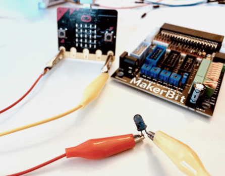

# MakerBit IR Sender

[](https://travis-ci.org/1010Technologies/pxt-makerbit-ir-transmitter)

MakeCode extension for sending commands via an IR-emitting LED. It works with any infrared receivers that are compatible with the NEC IR protocol.

## MakerBit Board

The MakerBit connects to the BBC micro:bit to provide easy connections to a wide variety of sensors, actuators and other components.

http://makerbit.com/

|  |  |
| :----------------------------------------------------------------------------------------------: | :----------------------------------------------------------------------------------------------------: |
|                                            _MakerBit_                                            |                                   _MakerBit+R with motor controller_                                   |

## IR Sender Blocks

These blocks allow you to send commands compatible with any NEC-compliant IR remote control:

```sig
makerbit.connectIrSenderLed(AnalogPin.P0)
makerbit.sendIrDatagram("0x00FF02FD");
makerbit.irNec(0, 2);
```



In this photo, the IR emitter LED is connected directly to the micro:bit with alligator clips. The short leg of the LED is connected with the yellow alligator clip to GND (ground), and the red wire to P0.

When using the MakerBit, you can use a ribbon cable connected to the blue analog box, a 2-wire connected to the pins inside the blue analog box, or with the MakerBit+R, you can use the black and yellow wires for Gnd and P0.

You can control the IR emitting LED with any of the other pins of the MakerBit. P0 is used in this example just because it’s easily accessible with alligator clips for those that don’t have the MakerBit.

### MakerBit connectIrSenderLed

Connects to the IR-emitting LED at the specified pin.

```sig
makerbit.connectIrSenderLed(AnalogPin.P0)
```

### MakerBit sendIrDatagram

Sends a 32bit IR datagram using the NEC protocol.

```sig
makerbit.sendIrDatagram("0x00FF02FD");
```

The send IR datagram block sends a coded number that is shown here in hexidecimal format. For the example number of 0x00FF02FD, there are two parts. The first part is “0x00FF” which is the address of the intended receiving device, and “02FD” which is the command.

### MakerBit irNec

Returns an NEC IR datagram as a 32bit hex string.

```sig
makerbit.irNec(0, 2);
```

Rather than having to encode a number in hexadecimal though, you use the address + command block.

This is combined with the send IR datagram block like this:

```sig
makerbit.sendIrDatagram(makerbit.irNec(0, 2));
```

You can have a look at the hex string by using the showString block:

```sig
basic.showString(makerbit.irNec(74, 179))
```

### Emulate a Keyes Remote Control

The “IR button” block from the IR Receive blocks can be used in the IR Sender to make it very easy to send the number and direction buttons like the Keyes IR remote does.

The IR Receive blocks ignores the address, so that part would only be used for controlling commercial devices like TVs, etc.

```sig
makerbit.sendIrDatagram(makerbit.irNec(0, makerbit.irButton(IrButton.Ok)))
```

## License

Licensed under the MIT License (MIT). See LICENSE file for more details.

## Supported targets

- for PXT/microbit
- for PXT/calliope
